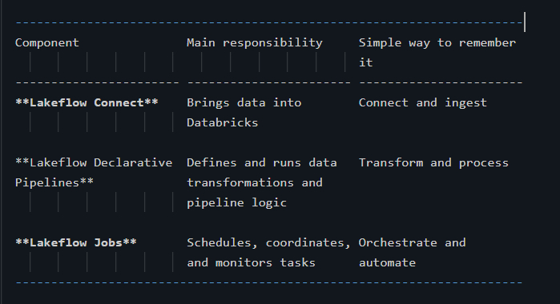
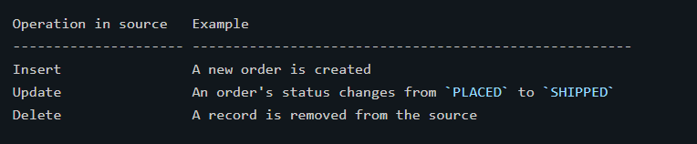
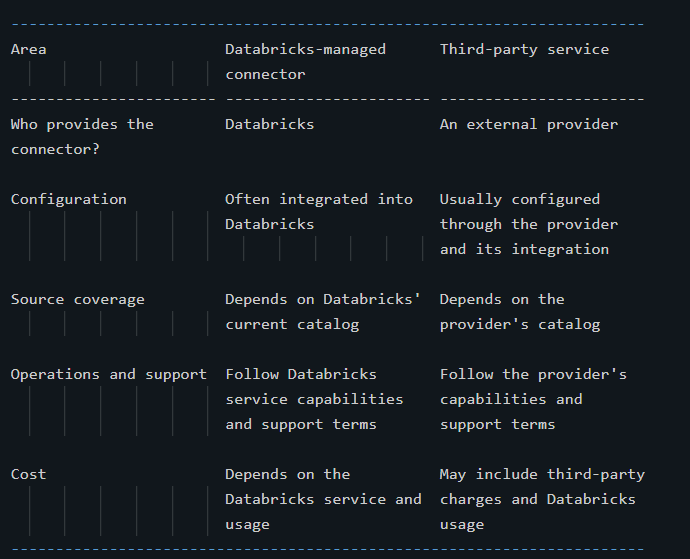
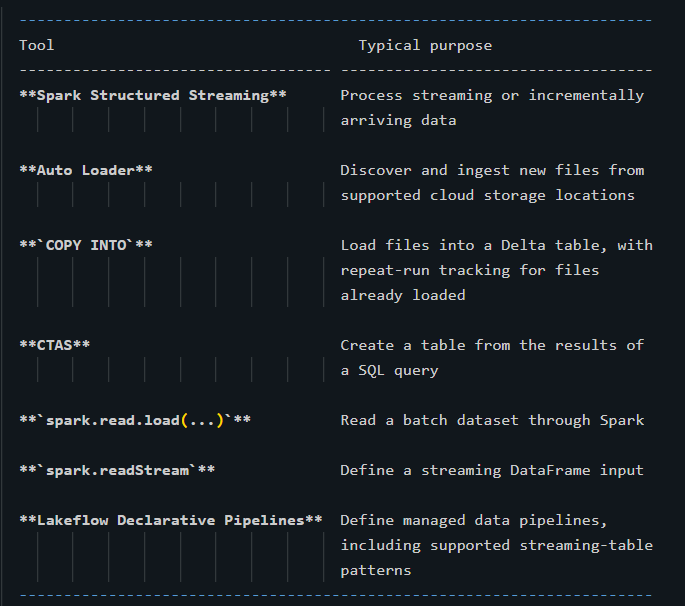
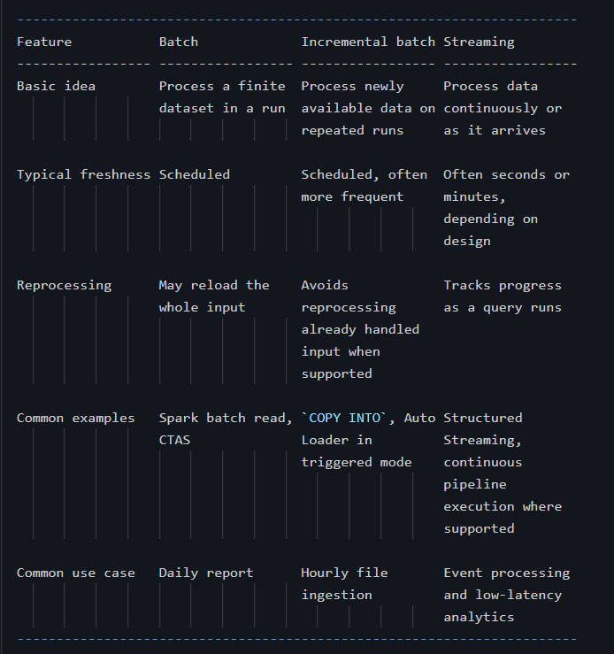
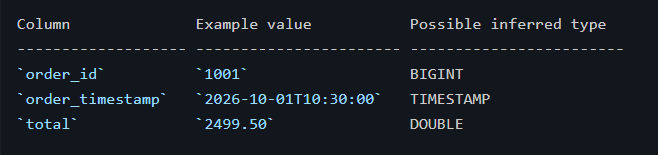

# Databricks Lakeflow --- Beginner-Friendly Interview Notes

> **Purpose:** Understand Databricks Lakeflow from the basics, learn how
> data is ingested into the Lakehouse, and prepare for data engineering
> interviews.
>
> **Scope:** These notes are based on the supplied lecture transcript.
> Product names and user-interface steps can change over time, so verify
> current workspace options in your Databricks account.

------------------------------------------------------------------------

## 1. The big picture: What is data engineering?

Data engineering is the process of collecting data from different
systems, moving it to a useful place, cleaning and transforming it, and
making it available for analytics, reporting, and machine learning.

Imagine an online retail company. Its data may come from:

-   A sales application
-   A customer database
-   Website click events
-   CSV or JSON files stored in cloud storage
-   A CRM system such as Salesforce

Before analysts or machine-learning models can use this data, it usually
needs to be ingested, organized, cleaned, and refreshed.

### A typical data pipeline

``` text
Data Sources
    |
    v
Ingestion
    |
    v
Transformation and Quality Checks
    |
    v
Storage in the Lakehouse
    |
    v
Analytics / BI / AI / Machine Learning
```

A **data pipeline** is a sequence of steps that moves and processes data
from a source to a destination.

### What does ETL mean?

-   **Extract:** Read data from a source.
-   **Transform:** Clean, validate, join, or otherwise change the data.
-   **Load:** Store the processed data in a destination.

A related term is **ELT**: Extract, Load, Transform. In ELT, raw data is
loaded into the target platform first and transformed there. In modern
lakehouse systems, both patterns can be used.

------------------------------------------------------------------------

## 2. What is Databricks Lakeflow?

**Databricks Lakeflow** is a unified set of data-engineering
capabilities for building and managing data pipelines on Databricks. It
covers the major stages of data engineering:

1.  Ingesting data from sources
2.  Transforming data
3.  Orchestrating and scheduling pipeline tasks

Lakeflow helps reduce the amount of custom integration code and
operational work needed to build reliable pipelines.

### The three core components



These components work together, but they are not interchangeable.
Connect focuses on ingestion, Declarative Pipelines focuses on building
data-processing pipelines, and Jobs focuses on workflow orchestration.

### Example: Retail sales pipeline

Suppose sales data comes from Salesforce, a PostgreSQL database, and
JSON files in cloud storage.

1.  **Lakeflow Connect** ingests data from supported enterprise sources.
2.  Standard ingestion tools can bring in files or message streams.
3.  **Lakeflow Declarative Pipelines** cleans the data, handles
    transformations, and produces useful tables.
4.  **Lakeflow Jobs** schedules the relevant tasks and coordinates their
    execution.
5.  Analysts query the resulting tables, while BI dashboards and ML
    workloads consume the data.

### Why is Lakeflow useful?

Without a managed, unified approach, a team may need to build and
maintain separate ingestion scripts, transformation jobs, schedules,
retry logic, and monitoring. Lakeflow brings related capabilities
together and helps teams manage pipelines more consistently.

**Interview answer --- What is Databricks Lakeflow?**

Databricks Lakeflow is a unified data-engineering solution that helps
teams ingest, transform, and orchestrate data pipelines on Databricks.
Its three main components are Lakeflow Connect for ingestion, Lakeflow
Declarative Pipelines for data processing, and Lakeflow Jobs for
workflow orchestration.

------------------------------------------------------------------------

## 3. Lakeflow Connect: Introduction

**Lakeflow Connect** is the ingestion component of Lakeflow. It helps
move data from external systems and files into Databricks.

### Common source categories

-   **SaaS applications:** Salesforce, ServiceNow, Workday, and similar
    business applications
-   **Databases:** MySQL, PostgreSQL, Microsoft SQL Server, and other
    supported databases
-   **Cloud object storage:** Amazon S3, Azure Data Lake Storage (ADLS),
    and similar storage systems
-   **Message buses:** Apache Kafka, Amazon Kinesis, and similar
    event-streaming systems
-   **Files:** CSV, JSON, and other supported file formats
-   **Other systems:** Third-party ingestion services or custom
    integrations when needed

A connector is a tool or integration that knows how to read data from a
particular source or source category and deliver it to the target
platform.

### Connector categories covered in the lecture

1.  Databricks-managed connectors
2.  Standard/customizable ingestion methods
3.  Partner Connect and third-party ingestion services
4.  Community connectors, where available
5.  Manual file upload

The exact connector catalog changes over time. Always check which
sources and features are supported in your workspace and region.

------------------------------------------------------------------------

## 4. Managed connectors

### What are managed connectors?

Managed connectors are low-code or no-code ingestion connectors operated
and managed by Databricks for supported sources. Instead of writing an
entire ingestion integration yourself, you configure the connection,
choose what to ingest, select a destination, and configure refresh
behavior.

They are designed to reduce custom coding and operational effort.
Supported connectors can use incremental ingestion so that they do not
need to reload every record on every run.

There are two broad source groups in the lecture:

-   SaaS application connectors
-   Database connectors

### 4.1 SaaS connectors

**SaaS** means **Software as a Service**. A SaaS application is software
that users access as a hosted service, often over the internet.

Examples include Salesforce, ServiceNow, Workday, Google Analytics, and
SharePoint, subject to current connector availability.

A SaaS connector commonly communicates with the application through its
API. You configure a connection with the required authentication and
permissions, select the data objects to ingest, and choose the target
location.

**Example flow:**

``` text
Salesforce
    |
    | API + authorized credentials
    v
Managed ingestion pipeline
    |
    v
Databricks target tables
    |
    v
SQL analytics / transformations / BI
```

### 4.2 Database connectors

Database connectors ingest data from supported databases such as MySQL,
PostgreSQL, and Microsoft SQL Server.

They may need to account for network access, firewalls, credentials, and
database load. Some connectors support change synchronization through
**Change Data Capture (CDC)**.

### What is CDC?

**Change Data Capture (CDC)** is a method of identifying changes made to
data in a source system. Common changes include:

-   **INSERT:** A new row is added.
-   **UPDATE:** An existing row is changed.
-   **DELETE:** A row is removed.

Instead of repeatedly copying the entire database, a CDC-based process
can capture and apply changes, helping the destination stay synchronized
with the source.

Example:


**Important:** CDC is a change-capture technique, not a database or a
destination table.

### Incremental ingestion

Incremental ingestion processes new or changed data instead of reloading
everything each time. It can reduce source-system load, data transfer,
processing time, and cost.

Incremental ingestion depends on the connector and source capabilities.
It is not safe to assume that every connector captures every type of
change in exactly the same way.

------------------------------------------------------------------------

## 5. Managed database connector architecture: concepts

The lecture describes a database-ingestion architecture with an
**Ingestion Gateway**, a staging area in a Unity Catalog volume, and a
serverless pipeline that loads the staged data into target tables. Exact
implementation details can vary by connector and product version.

### Important terms

-   **Ingestion Gateway:** A component used by the described
    architecture to connect to a source database and collect metadata,
    snapshots, or change information.
-   **Snapshot:** A representation of the source data at a particular
    point in time.
-   **Change log:** Information describing changes made after or around
    a snapshot.
-   **Staging area:** Temporary or intermediate storage where data waits
    before a later processing step.
-   **Unity Catalog volume:** A governed location for storing files in
    Databricks.
-   **Streaming table:** A table designed for incremental or streaming
    data processing in supported Databricks pipeline patterns.
-   **Serverless compute:** Compute infrastructure managed by the
    platform, where supported, rather than infrastructure that the user
    manages directly.

### Simplified flow

``` text
External Database
       |
       v
Ingestion Gateway / source extraction
       |
       v
Staged snapshots and change data
in a Unity Catalog volume
       |
       v
Serverless ingestion/processing pipeline
       |
       v
Target Delta tables
```

Conceptually, one stage connects to the source and stages the required
data, while another stage processes that data into the destination.
Credentials should be configured through supported secure connection
mechanisms, rather than written directly into notebook code.

### Control plane vs. data plane

-   **Control plane:** Manages configuration, coordination, and
    monitoring.
-   **Data plane:** Performs the actual data processing and movement.

A useful interview-level distinction is that the control plane manages
the service, while the data plane does the work on the data. The precise
division of responsibilities depends on the Databricks service and
architecture.

------------------------------------------------------------------------

## 6. Partner Connect and third-party ingestion

Sometimes a required source does not have a suitable Databricks-managed
connector. A third-party ingestion service may fill the gap.

The lecture mentions **Fivetran** as an example of a third-party service
that provides connectors for many sources and can deliver data to
Databricks.

### Typical flow

``` text
Source application or database
             |
             v
Third-party ingestion service
        (for example, Fivetran)
             |
             v
Databricks tables
```

A third-party tool may offer a broad connector catalog or specialized
capabilities. However, it may involve separate pricing, configuration,
permissions, and operational considerations.

### Managed connector vs. third-party connector



Do not assume that one option is always better. Compare supported
sources, freshness requirements, reliability, governance, cost, and
operational ownership.

------------------------------------------------------------------------

## 7. Standard connectors and customizable ingestion

In the lecture, **standard connectors** refers to customizable ingestion
approaches for sources such as cloud object storage and message buses.
These commonly require Python or SQL code.

The lecture covers these tools:

These tools are related but not identical. The best choice depends on
the source, latency requirement, file volume, state management, and
desired operating model.

### 7.1 Batch ingestion

**Batch ingestion** processes a finite collection of data in a run. It
might execute once, daily, hourly, or on another schedule.

Example: At midnight, load yesterday's sales file and prepare a report.

Traditional batch processing may read the full source dataset each run.
That can be appropriate for small datasets or full-refresh requirements,
but it can become expensive as data grows.

A basic Spark batch-read example:

``` python
df = spark.read.format("json").load("/path/to/sales/")
display(df)
```

Explanation:

-   `spark.read` defines a batch read.
-   `format("json")` identifies the input format.
-   `load(...)` specifies the input path.
-   `display(df)` displays the DataFrame in a Databricks notebook.

Replace the example path with a location that exists and that your
workspace is authorized to access.

### 7.2 Incremental batch ingestion

**Incremental batch ingestion** runs periodically but processes new data
since an earlier run, rather than deliberately reloading the entire
source every time.

Example: Every hour, discover newly arrived sales files and ingest them.

Typical options include:

-   `COPY INTO` for supported file-based loading patterns
-   Auto Loader in a triggered or scheduled execution pattern
-   Structured Streaming in triggered mode
-   Supported streaming-table pipelines in a triggered pipeline mode

Incremental processing can reduce repeated work, but it requires a
mechanism to track progress and avoid unintended duplicate processing.

#### Example: `COPY INTO`

``` sql
COPY INTO main.sales.orders
FROM '/Volumes/main/raw/sales/'
FILEFORMAT = JSON;
```

This illustrates the general form of `COPY INTO`. Before running it,
make sure that:

-   The target catalog, schema, and table are appropriate for your
    workspace.
-   The source path exists and contains supported JSON files.
-   Your identity has the necessary permissions.
-   The target table and schema are compatible with the input data.

`COPY INTO` tracks files it has already loaded for a given target and
can skip them on subsequent runs. This is useful for file ingestion, but
it is not a general-purpose CDC engine for arbitrary source databases.

### 7.3 Streaming ingestion

**Streaming ingestion** processes data as it arrives, often with low
latency. It is useful when data is continuously produced, such as events
from Apache Kafka or Amazon Kinesis.

Many Spark Structured Streaming queries use **micro-batches**: the
engine processes small groups of newly available records repeatedly.
Some supported execution modes can operate differently, so streaming
should not be equated with one universal execution model.

Example using Spark Structured Streaming:

``` python
df = (
    spark.readStream
         .format("json")
         .load("/path/to/incoming/files/")
)
```

This defines a streaming DataFrame from a file source. It does not, by
itself, start a running query or write any output. A complete streaming
application also needs a sink, a write operation, and appropriate
checkpointing and execution configuration.

### Batch vs. incremental batch vs. streaming


**Interview tip:** Incremental batch is still run-based processing.
Streaming is designed for ongoing processing. The distinction is about
execution and progress handling, not merely whether a job runs
frequently.

------------------------------------------------------------------------

## 8. Important tools explained simply

### 8.1 Auto Loader

Auto Loader is a Databricks capability for incrementally discovering and
ingesting new files from supported cloud storage locations into Spark
processing.

Why use it?

-   It can handle large numbers of files.
-   It tracks ingestion progress using checkpoint/state information.
-   It supports evolving file-ingestion workloads.
-   It can be used in streaming queries and scheduled/triggered
    patterns.

The exact configuration depends on the file format, schema strategy,
storage location, and execution mode.

### 8.2 `COPY INTO`

`COPY INTO` is a SQL command for loading files into a target table. It
is particularly useful for incremental file ingestion because it can
track files already loaded for that target.

Use it when a SQL-oriented, file-based ingestion workflow fits the
requirement. It is not a replacement for every streaming or
database-ingestion tool.

### 8.3 CTAS --- Create Table As Select

CTAS means **Create Table As Select**. It creates a table using the
result of a query.

Example:

``` sql
CREATE TABLE main.analytics.high_value_orders AS
SELECT order_id, customer_id, total
FROM main.raw.orders
WHERE total >= 1000;
```

What happens?

1.  SQL reads from `main.raw.orders`.
2.  It filters rows whose `total` is at least 1000.
3.  It selects three columns.
4.  It creates `main.analytics.high_value_orders` from the query result.

CTAS is useful for creating a table from existing tables or views. By
itself, it is not a complete continuously updating pipeline.

### 8.4 Spark Structured Streaming

Structured Streaming is Spark's processing engine for streaming
DataFrames and Datasets. In Databricks, it can be used to process
supported streaming sources and write results to supported sinks.

Remember:

-   `spark.read` is used for batch reads.
-   `spark.readStream` defines a streaming input.
-   A complete query also needs output logic, and commonly checkpoint
    configuration for fault-tolerant progress tracking.

### 8.5 Delta tables

A Delta table is a table that uses the Delta Lake storage format and
transaction log. Delta Lake adds capabilities such as transactional
consistency and reliable table operations to data stored in the
Lakehouse.

In these notes, "target Delta table" means the table where ingested data
is stored for later queries or transformations.

------------------------------------------------------------------------

## 9. Manually uploading files to Databricks

Manual upload is useful for learning, small demos, initial testing, and
occasional ad-hoc tasks. It is generally not the first choice for large,
recurring production ingestion because it is not an automated
source-to-target pipeline.

### Two outcomes described in the lecture

1.  **Create or modify a table:** Upload a supported file and use the
    interface to create a table.
2.  **Store files in a Unity Catalog volume:** Keep the uploaded files
    in a governed file-storage location for later use.

A table is intended for structured querying. A volume is a governed
place to store files; it is not itself a table.

### General UI workflow

The precise labels may vary by workspace version:

1.  Open the data-ingestion area, or use the workspace's **New** menu
    and choose the available upload-data option.
2.  Choose whether to create a table or store files in a volume.
3.  Select or browse to the local file.
4.  For table creation, choose create-new or overwrite-existing as
    appropriate.
5.  Select the target catalog and schema.
6.  Enter a table name.
7.  Review the preview and inferred column types.
8.  Adjust types or advanced options if necessary.
9.  Confirm the upload and table creation.

### Example: Retail sales JSON file

Suppose a file contains:

``` json
{
  "order_id": 1001,
  "order_timestamp": "2026-10-01T10:30:00",
  "total": 2499.50
}
```

The upload interface may infer these types:



Type inference is an estimate based on the file's contents. Always
review it. A timestamp stored as a string, an identifier with leading
zeros, or a financial value that needs exact decimal precision may
require a deliberate schema choice.

If automatic type detection is disabled in the upload flow described by
the lecture, columns may be imported as strings. The precise options
depend on the current interface.

### Why is type selection important?

Incorrect data types can lead to failed transformations, incorrect
comparisons, parsing errors, or unexpected calculations.

For example, if `total` is stored as a string, numeric sorting and
arithmetic may not behave as expected until it is converted.

------------------------------------------------------------------------

## 10. Unity Catalog basics

Unity Catalog is Databricks' governance layer for managing and
controlling access to data and other securable assets.

A common three-level namespace is:

``` text
catalog.schema.table
```

For example:

``` text
main.sales.orders
```

-   `main` --- catalog
-   `sales` --- schema
-   `orders` --- table

A **schema** groups related objects such as tables and views. A
**volume** is used for governed file storage.

This structure helps teams organize data by domain, project,
environment, or ownership. Access still depends on the permissions
configured for the relevant objects.

------------------------------------------------------------------------

## 11. End-to-end example: From source to analytics

Imagine a retailer wants a dashboard showing sales by day and product.

### Step 1: Ingest the data

-   Use a managed connector if the source is a supported enterprise
    application or database.
-   Use Auto Loader or `COPY INTO` for suitable file-ingestion patterns.
-   Use Structured Streaming for supported event streams.
-   Use a third-party connector when it better fits the source and
    requirements.

### Step 2: Store the raw data

Land the data in appropriate tables or storage locations with suitable
permissions and organization.

### Step 3: Transform the data

Use SQL, Python, or Lakeflow Declarative Pipelines to validate records,
standardize columns, handle missing values, join datasets, and calculate
metrics.

### Step 4: Orchestrate the work

Use Lakeflow Jobs or the appropriate pipeline scheduling capabilities to
coordinate runs, configure dependencies, and monitor execution.

### Step 5: Consume the output

Analysts query the curated tables. BI tools, applications, and ML
workloads can use the prepared data according to their requirements.

``` text
Salesforce / Database / Cloud Files / Events
                    |
                    v
       Lakeflow Connect / Ingestion Tools
                    |
                    v
             Raw Data Tables
                    |
                    v
    Lakeflow Declarative Pipelines / SQL
                    |
                    v
           Curated Delta Tables
                    |
                    v
      BI / Analytics / AI / ML / Sharing

Lakeflow Jobs helps schedule and coordinate tasks across the workflow.
```

------------------------------------------------------------------------

## 12. Interview questions and model answers

### Q1. What is Databricks Lakeflow?

**Answer:** Databricks Lakeflow is a unified data-engineering solution
for ingesting, transforming, and orchestrating data pipelines on
Databricks. Its three core components are Lakeflow Connect, Lakeflow
Declarative Pipelines, and Lakeflow Jobs.

### Q2. What is Lakeflow Connect?

**Answer:** Lakeflow Connect is the ingestion component. It helps bring
data from supported databases, SaaS applications, and other sources into
Databricks using managed connectors or other ingestion methods.

### Q3. What is the difference between Lakeflow Connect and Lakeflow Jobs?

**Answer:** Lakeflow Connect focuses on bringing data into Databricks.
Lakeflow Jobs focuses on scheduling and coordinating tasks or workflows.
One is primarily about ingestion; the other is about orchestration.

### Q4. What is the difference between a managed connector and a customizable ingestion method?

**Answer:** A managed connector provides a prebuilt integration for a
supported source and reduces the need to write ingestion code. A
customizable approach uses tools such as Auto Loader, `COPY INTO`, or
Structured Streaming, with the developer defining more of the ingestion
logic.

### Q5. What is CDC?

**Answer:** Change Data Capture identifies changes in source data, such
as inserts, updates, and deletes, so a destination can be synchronized
without repeatedly reloading the entire source.

### Q6. Why is incremental ingestion useful?

**Answer:** It avoids repeating unnecessary work when the source or
ingestion method supports progress tracking. This can reduce data
transfer, processing time, source load, and cost.

### Q7. What is the difference between batch and streaming ingestion?

**Answer:** Batch ingestion processes a finite dataset in a run.
Streaming ingestion is designed to process continuously arriving data or
repeated small increments with low latency. The right choice depends on
freshness and processing requirements.

### Q8. What is incremental batch ingestion?

**Answer:** It is run-based ingestion that processes new data on
repeated runs instead of reloading the entire dataset each time. Tools
such as `COPY INTO` and Auto Loader in a triggered pattern can support
this type of workflow.

### Q9. What is Auto Loader?

**Answer:** Auto Loader is a Databricks capability for incrementally
discovering and ingesting new files from supported cloud storage
locations into Spark processing.

### Q10. What is `COPY INTO` used for?

**Answer:** It is a SQL command used to load files into a target table.
It can track files already loaded for a target and skip them on later
runs.

### Q11. What is CTAS?

**Answer:** CTAS stands for Create Table As Select. It creates a table
from the result of a SQL query.

### Q12. What is a Unity Catalog volume?

**Answer:** A Unity Catalog volume is a governed storage location for
files. It is useful when files need to be stored and accessed under
Databricks governance controls.

### Q13. What is the difference between a table and a volume?

**Answer:** A table stores structured data that can be queried using
SQL. A volume stores files. A file in a volume does not automatically
become a queryable table.

### Q14. Why might a team use Fivetran or another partner?

**Answer:** A third-party provider may support a source that is not
covered by a suitable managed connector or may offer additional
capabilities. The team should compare functionality, cost, reliability,
governance, and support.

### Q15. What is the control plane versus the data plane?

**Answer:** The control plane manages configuration, coordination, and
monitoring. The data plane performs the data processing and movement.
The exact boundary depends on the service architecture.

### Q16. Is manual file upload recommended for production ingestion?

**Answer:** It can work for small ad-hoc tasks, tests, and demos. For
recurring production ingestion, an automated, monitored, and repeatable
pipeline is generally preferable.

### Q17. What happens if automatic schema detection chooses the wrong type?

**Answer:** The inferred schema should be reviewed and corrected where
necessary. Incorrect types can cause parsing problems or incorrect
calculations. The correct type depends on how the column will be used.

### Q18. How would you design a basic retail data pipeline?

**Answer:** First, identify the sources and freshness requirements.
Ingest data using suitable connectors or file/stream tools, store it in
governed tables, transform and validate it, schedule and monitor the
workflow, and make the curated output available to analytics or
downstream applications.

------------------------------------------------------------------------

## 13. Common interview traps and misconceptions

1.  **Lakeflow is not just an ingestion tool.** It covers ingestion,
    pipeline development, and orchestration through its core components.
2.  **A connector and an orchestrator are different.** A connector
    brings in data; orchestration coordinates when and how tasks run.
3.  **Incremental batch is not the same as continuous streaming.**
    Incremental batch runs periodically; streaming is designed for
    ongoing processing.
4.  **CDC is not a storage format.** It is a technique for capturing
    data changes.
5.  **`COPY INTO` is not a universal ingestion solution.** It is mainly
    a file-loading command with file-ingestion tracking behavior.
6.  **Defining a streaming DataFrame does not start a complete streaming
    application.** A query still needs output logic and appropriate
    execution configuration.
7.  **A volume is not a table.** A volume stores files; a table stores
    structured data for querying.
8.  **Schema inference is not guaranteed to be correct.** Review types,
    especially for timestamps, identifiers, and financial data.
9.  **Managed does not mean configuration-free.** Authentication,
    permissions, networking, source selection, destinations, and
    scheduling may still need setup.
10. **Feature availability can change.** Check current Databricks
    documentation and workspace UI rather than relying solely on an
    older tutorial.

------------------------------------------------------------------------

## 14. Quick revision sheet

-   **Lakeflow:** Unified Databricks data-engineering capabilities.
-   **Lakeflow Connect:** Ingest data.
-   **Lakeflow Declarative Pipelines:** Define and operate
    data-processing pipelines declaratively.
-   **Lakeflow Jobs:** Orchestrate and schedule tasks.
-   **Managed connector:** Prebuilt, Databricks-managed ingestion for
    supported sources.
-   **SaaS:** Software as a Service; hosted business applications.
-   **CDC:** Capture inserts, updates, and deletes.
-   **Batch:** Process a finite dataset in a run.
-   **Incremental batch:** Repeated runs process newly available data.
-   **Streaming:** Process ongoing data arrivals with low latency.
-   **Auto Loader:** Incrementally discover and ingest supported cloud
    files.
-   **`COPY INTO`:** Load files into a target table with repeat-run file
    tracking.
-   **CTAS:** Create a table from a SQL query result.
-   **Structured Streaming:** Spark's API and engine for streaming data
    processing.
-   **Delta table:** A table using the Delta Lake format and transaction
    log.
-   **Unity Catalog:** Governance and organization for Databricks data
    assets.
-   **Catalog → Schema → Table:** A common three-level namespace.
-   **Volume:** Governed storage for files.
-   **Partner connector:** Third-party ingestion option.
-   **Control plane:** Configuration and management.
-   **Data plane:** Data processing and movement.

------------------------------------------------------------------------

## 15. Practice questions

Try answering these without looking at the model answers:

1.  Explain Lakeflow in your own words.
2.  Describe the responsibility of each of Lakeflow's three core
    components.
3.  When would you use a managed connector rather than write custom
    ingestion code?
4.  Explain CDC using an order-status update as an example.
5.  Compare batch, incremental batch, and streaming ingestion.
6.  When would you choose Auto Loader over a manual upload?
7.  Explain what `COPY INTO` does and what it does not do.
8.  Explain the difference between a Unity Catalog table and a volume.
9.  A source delivers a large number of JSON files every hour. What
    ingestion options would you evaluate, and why?
10. How would you schedule, monitor, and make an ingestion workflow
    reliable?

### A simple self-check rubric

-   **Beginner:** Can define the terms and explain the main components.
-   **Interview-ready:** Can compare approaches and justify a choice
    based on the use case.
-   **Project-ready:** Can discuss schema handling, permissions,
    incremental progress, error handling, monitoring, and cost
    trade-offs.

------------------------------------------------------------------------

## 16. Suggested next learning order

1.  Lakeflow Connect overview
2.  Manual file upload and Unity Catalog basics
3.  Managed SaaS and database connectors
4.  CDC and incremental ingestion
5.  Batch ingestion and Spark reads
6.  `COPY INTO`
7.  Auto Loader
8.  Spark Structured Streaming
9.  Lakeflow Declarative Pipelines
10. Lakeflow Jobs and workflow orchestration

**Final takeaway:** Learn the purpose of each component first, then
understand the ingestion mode and tool choices. In interviews, explain
not only *what* a tool does, but also *why* you would choose it for a
particular data source and freshness requirement.
