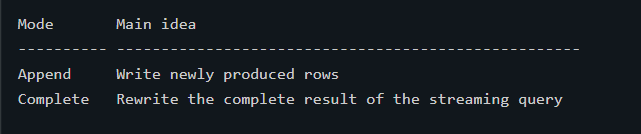
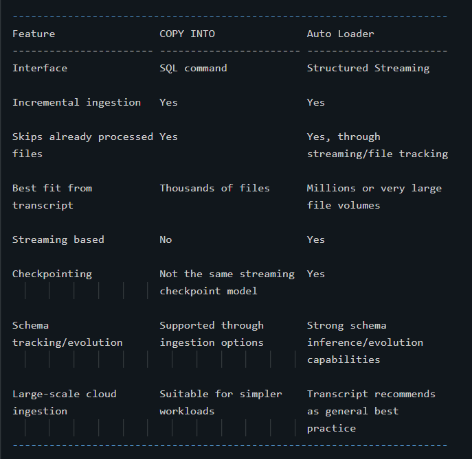

# Databricks Interview Notes --- Structured Streaming, Auto Loader & Medallion Architecture

> **Level:** Beginner → Interview Ready\
> **Based on:** Your supplied Databricks transcript\
> **Focus:** Understand the concept, remember the syntax, and explain it
> simply in interviews.

------------------------------------------------------------------------

# 1. What Is Streaming Data?

A **data stream** is a data source that keeps growing over time.

Examples:

-   New JSON/log files continuously arriving in cloud storage
-   Database changes arriving through **CDC (Change Data Capture)**
-   Events arriving through a messaging system such as **Kafka**
-   New records continuously being added to a Delta table

Think of it like this:

``` text
10:00 → 100 records
10:05 → 20 new records arrive
10:10 → 50 more records arrive
10:15 → more data...
```

The dataset does not have a fixed end, so it is called an **unbounded**
dataset/table.

## Traditional approach vs streaming

Without streaming, we might repeatedly process the entire dataset:

``` text
Run 1 → Process everything
Run 2 → Process everything again
Run 3 → Process everything again
```

This becomes expensive as data grows.

With incremental streaming:

``` text
Run 1 → Process existing data
Run 2 → Process only new data
Run 3 → Process only newly arrived data
```

This is the main idea behind **Spark Structured Streaming**.

### Interview question

**Q: What is streaming data?**

**Answer:** Streaming data is continuously arriving data. Instead of
repeatedly processing the entire dataset, a streaming system
incrementally processes newly arrived records.

------------------------------------------------------------------------

# 2. Spark Structured Streaming

**Spark Structured Streaming** is Spark's scalable stream-processing
engine.

Its key idea is simple:

> Treat an continuously growing data stream as if it were a table.

New data arriving in the stream is conceptually treated as new rows
being added to this unbounded table.

Possible streaming sources mentioned in the transcript include:

-   directories/files,
-   Kafka or other messaging systems,
-   Delta tables.

The normal flow is:

``` text
Streaming Source
      ↓
readStream
      ↓
Streaming DataFrame
      ↓
Transformations
      ↓
writeStream
      ↓
Sink / Target
```

A **source** is where data comes from.

A **sink** is where processed data is written, such as files or tables.

------------------------------------------------------------------------

# 3. `readStream` vs Normal `read`

For normal batch processing:

``` python
df = spark.read.table("books")
```

For streaming:

``` python
df = spark.readStream.table("books")
```

A streaming DataFrame continuously represents existing and newly
arriving data from the source.

The transcript emphasizes that incremental processing must start with
the **read logic**. If you want an incremental streaming write later,
the upstream DataFrame must have been created as a streaming DataFrame.

### Interview question

**Q: What is the difference between `spark.read` and
`spark.readStream`?**

**Answer:** `spark.read` creates a static/batch DataFrame from the data
available at that time. `spark.readStream` creates a streaming DataFrame
that can continuously process new data arriving in the source.

------------------------------------------------------------------------

# 4. `writeStream`

A streaming DataFrame is persisted using `writeStream`.

Conceptually:

``` python
query = (
    streaming_df.writeStream
    .outputMode("append")
    .option("checkpointLocation", checkpoint_path)
    .trigger(processingTime="2 minutes")
    .toTable("target_table")
)
```

Three important configurations from the transcript are:

1.  **Trigger**
2.  **Output mode**
3.  **Checkpoint location**

These are very important for interviews.

------------------------------------------------------------------------

# 5. Streaming Triggers

A **trigger** determines when Spark processes the next set of streaming
data.

## Processing-time trigger

Example:

``` python
.trigger(processingTime="5 minutes")
```

Spark checks/processes available data in micro-batches at the configured
interval.

Conceptually:

``` text
00:00 → Batch
00:05 → Batch
00:10 → Batch
00:15 → Batch
```

## `trigger(once=True)`

Processes all currently available data in a single batch and then stops.

## `availableNow`

Processes all currently available data and then stops automatically.

The transcript distinguishes it from `Once` by explaining that
`availableNow` can process the available data through multiple
micro-batches.

Conceptually:

``` text
New available files
       ↓
Micro-batch 1
       ↓
Micro-batch 2
       ↓
Micro-batch 3
       ↓
STOP
```

This is useful when you want **incremental processing without keeping a
stream running continuously**.

### Interview question

**Q: What is `availableNow`?**

**Answer:** `availableNow` is a trigger that processes all currently
available new data and then automatically stops. It provides incremental
processing while behaving like a triggered batch workload.

------------------------------------------------------------------------

# 6. Streaming Output Modes

The transcript focuses on two output modes.

## Append mode

``` python
.outputMode("append")
```

Only newly produced rows are added to the target.

Useful when the query naturally produces final new records.

## Complete mode

``` python
.outputMode("complete")
```

The complete result is recalculated and written for every trigger.

The transcript uses this for streaming aggregations.

Example:

``` text
Author      Count
A           5
B           10
```

If more books arrive, the counts change, so the complete aggregation
result is rewritten.

### Interview comparison


------------------------------------------------------------------------

# 7. Checkpointing --- Extremely Important

Spark needs to remember how far a stream has already processed.

That information is stored in a **checkpoint**.

Example:

``` python
.option("checkpointLocation", "/path/checkpoints/books")
```

Checkpoint information helps Spark track streaming progress.

Think of it as a bookmark:

``` text
Files:
1 ✓
2 ✓
3 ✓
4 ← last processed point
5 new
6 new
```

After a failure, Spark can use the checkpoint to continue from the
previous progress rather than blindly starting again.

## Important rule

**Do not share one checkpoint location between multiple streaming
writes.**

Each streaming write needs its own checkpoint location.

### Interview-ready answer

**Q: Why do we need checkpoints in Structured Streaming?**

**Answer:** Checkpoints store the state and progress of a streaming
query. They allow Spark to know what has already been processed and help
the stream resume after failures. Each streaming write should have its
own checkpoint location.

------------------------------------------------------------------------

# 8. Fault Tolerance and Exactly-Once Concept

The transcript explains that Structured Streaming uses mechanisms
including:

-   checkpointing,
-   write-ahead/progress information,
-   repeatable sources,
-   idempotent sinks.

An **idempotent** write means processing the same logical data again
should not create an incorrect duplicate result.

Conceptually:

``` text
Batch 10 starts
      ↓
Failure
      ↓
Spark restarts
      ↓
Uses checkpoint/progress
      ↓
Safely continues/reprocesses as required
```

The transcript presents repeatable sources plus idempotent sinks as the
basis for end-to-end exactly-once semantics under failure conditions.

### Interview term

**Idempotent:** Repeating the same operation does not incorrectly change
the final result multiple times.

------------------------------------------------------------------------

# 9. Streaming DataFrame Limitations

Most DataFrame operations are similar between batch and streaming
DataFrames, but some operations are difficult on unbounded data.

The transcript specifically mentions operations such as:

-   sorting,
-   deduplication,

as requiring special handling in streaming scenarios.

Why?

Imagine sorting an infinite stream:

``` text
5, 2, 8, 1, ...
```

You cannot know the final order because future data can always contain
another value.

Advanced streaming concepts such as **windowing** and **watermarking**
help handle these types of problems.

The transcript does not go deeply into those concepts, so they are kept
as advanced topics here.

------------------------------------------------------------------------

# 10. Streaming Temporary Views

A streaming DataFrame can be registered as a temporary view.

Conceptually:

``` python
stream_df.createOrReplaceTempView("books_stream")
```

SQL can then be used against that streaming view.

This allows a useful workflow:

``` text
PySpark readStream
       ↓
Streaming temporary view
       ↓
Spark SQL transformations
       ↓
Streaming temporary view/result
       ↓
PySpark DataFrame
       ↓
writeStream
```

The transcript demonstrates switching between PySpark and SQL in this
way.

### Important

Querying/displaying a streaming view can start a streaming query that
remains active while waiting for new data.

------------------------------------------------------------------------

# 11. Continuous Stream vs `availableNow`

## Always-running stream

Example idea:

``` python
.trigger(processingTime="4 seconds")
```

The stream stays active and continuously checks for/processes new data.

Useful when low-latency continuous processing is needed.

## Triggered incremental processing

``` python
.trigger(availableNow=True)
```

It:

1.  starts,
2.  processes currently available new data,
3.  stops automatically.

This can be useful for scheduled incremental pipelines.

The transcript also uses:

``` python
query.awaitTermination()
```

to wait until the triggered stream has completed.

------------------------------------------------------------------------

# 12. Why Stop Active Streams?

The transcript gives an important practical warning.

An always-running streaming query remains active and can keep compute
resources active.

During development, streams that are no longer needed should be
stopped/cancelled.

This is especially important when cluster auto-termination is expected.

------------------------------------------------------------------------

# 13. Incremental File Ingestion

Suppose a cloud folder receives files every day:

``` text
Day 1 → file1.parquet
Day 2 → file2.parquet
Day 3 → file3.parquet
```

A poor ingestion design repeatedly processes:

``` text
Day 3 → file1 + file2 + file3
```

An incremental design processes only:

``` text
Day 3 → file3
```

The transcript introduces two Databricks mechanisms:

1.  **COPY INTO**
2.  **Auto Loader**

------------------------------------------------------------------------

# 14. `COPY INTO`

`COPY INTO` is a SQL command used to load files into a Delta table
incrementally.

Conceptually:

``` sql
COPY INTO target_table
FROM '/source/path'
FILEFORMAT = PARQUET;
```

For CSV, format-specific options can also be provided.

The transcript describes `COPY INTO` as **incremental and idempotent**
for file ingestion:

``` text
Run 1:
file1 ✓
file2 ✓

Run 2:
file1 skipped
file2 skipped
file3 loaded ✓
```

Previously loaded files are skipped and newly discovered files are
loaded.

### When does the transcript recommend it?

For file counts on the order of **thousands**, `COPY INTO` can be used.

------------------------------------------------------------------------

# 15. Auto Loader

**Auto Loader** is Databricks' mechanism for scalable incremental file
ingestion.

It is based on **Spark Structured Streaming**.

The transcript states that Auto Loader can scale to very large file
volumes and uses checkpointing to track ingestion progress and
discovered files.

Basic structure:

``` python
df = (
    spark.readStream
    .format("cloudFiles")
    .option("cloudFiles.format", "parquet")
    .option("cloudFiles.schemaLocation", schema_path)
    .load(source_path)
)
```

Then:

``` python
(
    df.writeStream
    .option("checkpointLocation", checkpoint_path)
    .toTable("orders_updates")
)
```

## The most important Auto Loader keyword

``` python
.format("cloudFiles")
```

This identifies the stream as an Auto Loader source.

The underlying source format is specified separately:

``` python
.option("cloudFiles.format", "parquet")
```

------------------------------------------------------------------------

# 16. Auto Loader `schemaLocation`

Auto Loader can infer the schema of incoming data.

The inferred schema can be stored using:

``` python
.option("cloudFiles.schemaLocation", schema_path)
```

Why store it?

Because Spark should not have to rediscover the schema from scratch
every time the stream starts.

Conceptually:

``` text
Input files
   ↓
Auto Loader infers schema
   ↓
Schema stored in schemaLocation
   ↓
Future stream starts reuse schema information
```

------------------------------------------------------------------------

# 17. Auto Loader Checkpoint vs Schema Location

Do not confuse these.

## Checkpoint location

Tracks **stream processing progress/state**.

``` python
.option("checkpointLocation", checkpoint_path)
```

## Schema location

Stores **inferred/evolved schema information**.

``` python
.option("cloudFiles.schemaLocation", schema_path)
```

In the transcript demo, the same directory is used for both, but
conceptually they serve different purposes.

### Interview question

**Q: What is the difference between checkpointLocation and
schemaLocation in Auto Loader?**

**Answer:** `checkpointLocation` tracks streaming progress so the stream
knows what has already been processed. `cloudFiles.schemaLocation`
stores Auto Loader's inferred and evolved schema information.

------------------------------------------------------------------------

# 18. Auto Loader File Detection Modes

The transcript describes two file-discovery approaches.

## Directory listing mode

Auto Loader scans the source directory to discover new files.

Conceptually:

``` text
Auto Loader
    ↓
List directory
    ↓
Compare discovered files
    ↓
Process new files
```

The transcript describes this as suitable for smaller workloads but
potentially more expensive at large scale because of repeated storage
listing operations.

## File notification mode

Configured in the transcript with:

``` python
.option("cloudFiles.useNotifications", "true")
```

Conceptually:

``` text
New file lands
      ↓
Cloud notification/event
      ↓
Auto Loader receives event
      ↓
File processed
```

The transcript notes that additional cloud infrastructure configuration
is required for event-based notifications.

------------------------------------------------------------------------

# 19. Auto Loader and File Overwrites

By default, the transcript describes Auto Loader as processing a file
path once.

If a file is replaced using the same path/name, it is normally ignored.

To allow overwritten files to be detected:

``` python
.option("cloudFiles.allowOverwrites", "true")
```

The transcript explains that Auto Loader can then use the path together
with modification information to detect and re-ingest the changed file.

### Caution

Re-ingesting a replaced file means your downstream design must account
for the repeated contents appropriately.

------------------------------------------------------------------------

# 20. Filtering Input Files

The transcript introduces:

``` python
.option("pathGlobFilter", "*.png")
```

Example:

``` python
spark.readStream \
    .format("cloudFiles") \
    .option("cloudFiles.format", "binaryFile") \
    .option("pathGlobFilter", "*.png") \
    .load("/path/to/files")
```

This is useful when the directory contains multiple file types but only
specific filenames/extensions should be ingested.

------------------------------------------------------------------------

# 21. Auto Loader Schema Inference

The transcript distinguishes self-describing and text-based formats.

For self-describing formats such as Parquet, schema/type information is
available from the files.

For text-based formats such as:

-   JSON,
-   CSV,
-   XML,

the transcript says Auto Loader treats columns as strings by default to
reduce type-mismatch problems across batches.

To infer more specific column types:

``` python
.option("cloudFiles.inferColumnTypes", "true")
```

Auto Loader can then sample data and infer types such as:

-   integer,
-   boolean,
-   timestamp.

------------------------------------------------------------------------

# 22. Auto Loader Schema Evolution

Real source schemas can change.

Example:

``` text
Yesterday:
id, name

Today:
id, name, email
```

The new `email` column represents **schema evolution**.

The transcript introduces:

``` python
.option(
    "cloudFiles.schemaEvolutionMode",
    <mode>
)
```

The default mode discussed is:

``` text
addNewColumns
```

According to the transcript, when a new column is discovered in this
mode:

1.  the stream detects the unknown field,
2.  schema information is updated in the schema location,
3.  the stream stops with an `UnknownFieldException`,
4.  on the next run, the stream can use the updated schema.

### Interview-ready answer

**Q: What is schema evolution?**

**Answer:** Schema evolution means handling changes in the structure of
incoming data, such as newly added columns. Auto Loader can track and
evolve its stored schema based on configured schema-evolution behavior.

------------------------------------------------------------------------

# 23. COPY INTO vs Auto Loader

This is a very likely interview comparison.


### Interview answer

**Q: When would you use COPY INTO versus Auto Loader?**

**Answer:** Both can incrementally ingest new files. `COPY INTO` is a
simple SQL-based approach and is suitable for smaller file-ingestion
workloads. Auto Loader is based on Structured Streaming and is designed
for highly scalable cloud file ingestion, with checkpointing and
schema-management capabilities.

------------------------------------------------------------------------

# 24. Medallion / Multi-Hop Architecture

The transcript next introduces **multi-hop architecture**, also called
**Medallion Architecture**.

Its purpose is to improve data quality and structure incrementally as
data moves through the pipeline.

The three layers are:

``` text
Sources
   ↓
BRONZE
   ↓
SILVER
   ↓
GOLD
```

------------------------------------------------------------------------

# 25. Bronze Layer

The **Bronze layer** contains raw or near-raw ingested data.

Possible sources include:

-   JSON files,
-   Parquet files,
-   operational databases,
-   Kafka streams.

The main goal is:

> Preserve the incoming data and ingest it reliably.

Useful metadata can also be added, such as:

-   source filename,
-   ingestion timestamp.

Example:

``` text
order_id
customer_id
books
order_timestamp
source_file
ingestion_time
```

Why save metadata?

If corrupted data is discovered later, source information makes
troubleshooting easier.

### Interview phrase

**Bronze = raw ingestion layer.**

------------------------------------------------------------------------

# 26. Silver Layer

The **Silver layer** contains cleaned, validated, transformed, and
enriched data.

The transcript's example includes:

-   joining orders with customer information,
-   adding customer details,
-   converting Unix timestamps into readable timestamps,
-   removing orders that contain no items.

Conceptually:

``` text
Bronze raw orders
        +
Customer lookup
        ↓
Cleaning
        ↓
Validation
        ↓
Enrichment
        ↓
Silver orders
```

### Interview phrase

**Silver = cleaned and enriched data.**

------------------------------------------------------------------------

# 27. Gold Layer

The **Gold layer** contains business-level data.

Typical uses:

-   dashboards,
-   reports,
-   KPIs,
-   aggregations,
-   machine-learning consumption.

The transcript creates an aggregated Gold table containing daily book
counts for each customer.

Conceptually:

``` text
Silver detailed records
        ↓
Business aggregation
        ↓
Gold table
        ↓
Dashboard / reporting
```

### Interview phrase

**Gold = business-ready aggregated data.**

------------------------------------------------------------------------

# 28. Why Use Medallion Architecture?

Benefits mentioned in the transcript include:

-   simple and understandable design,
-   incremental ETL,
-   combining batch and streaming workloads,
-   progressively improving data quality,
-   ability to rebuild downstream tables from raw data.

A good mental model is:

``` text
BRONZE
"What did the source send?"

SILVER
"What is the clean, trusted version?"

GOLD
"What does the business need?"
```

------------------------------------------------------------------------

# 29. Streaming Medallion Pipeline from the Transcript

The example pipeline works like this:

``` text
Parquet source files
        ↓
Auto Loader
        ↓
Streaming raw view
        ↓
Add source metadata
        ↓
orders_bronze
        ↓
Streaming read
        ↓
Join + clean + transform
        ↓
orders_silver
        ↓
Streaming read
        ↓
Aggregate
        ↓
daily_customer_books (Gold)
```

This is an excellent architecture to explain in a Databricks interview.

------------------------------------------------------------------------

# 30. Bronze Pipeline Example

The transcript starts Auto Loader against a Parquet source.

Conceptually:

``` python
raw_df = (
    spark.readStream
    .format("cloudFiles")
    .option("cloudFiles.format", "parquet")
    .option("cloudFiles.schemaLocation", schema_path)
    .load(source_path)
)
```

Then metadata can be added before writing to Bronze.

The resulting stream is written to:

``` text
orders_bronze
```

When another file arrives, Auto Loader detects it and adds its records
to Bronze.

------------------------------------------------------------------------

# 31. Silver Pipeline Example

The Bronze table becomes a streaming source.

Then transformations are applied.

From the transcript:

``` text
Bronze orders
    ↓
Join customer information
    ↓
Add customer name/details
    ↓
Convert timestamp
    ↓
Remove orders with no items
    ↓
Silver
```

The Silver table therefore contains more usable data than Bronze.

------------------------------------------------------------------------

# 32. Gold Pipeline Example

The Silver table is used to calculate business-level aggregations.

Example from the transcript:

``` text
Daily number of books per customer
```

The Gold stream uses:

``` text
availableNow
```

so it processes currently available data and stops.

It also uses:

``` text
complete output mode
```

because the aggregation result needs to be recalculated.

This demonstrates that one pipeline can combine:

-   continuously running streaming stages,
-   triggered incremental/batch-like stages.

------------------------------------------------------------------------

# 33. Important Streaming Caveat from the Transcript

The transcript emphasizes that Structured Streaming expects
append-oriented upstream data in this example.

If an upstream table is updated or overwritten, directly treating it as
a normal append stream can become problematic.

The transcript mentions options such as `ignoreChanges`, while also
noting that they have limitations.

For interview preparation, remember the central idea:

> A streaming pipeline must understand whether upstream changes are
> appends, updates, or overwrites.

Do not assume every changing Delta table behaves like a simple
append-only stream.

------------------------------------------------------------------------

# 34. Batch vs Streaming

  -----------------------------------------------------------------------
  Batch                               Streaming
  ----------------------------------- -----------------------------------
  Processes a bounded dataset         Processes an unbounded/growing
                                      dataset

  Usually runs and finishes           Can remain active continuously

  `spark.read`                        `spark.readStream`

  `df.write`                          `df.writeStream`

  Good for scheduled full/finite      Good for incremental/new data
  workloads                           

  No streaming checkpoint required    Checkpointing is important
  -----------------------------------------------------------------------

`availableNow` sits nicely between these ideas: it uses Structured
Streaming's incremental tracking but stops after currently available
data is processed.

------------------------------------------------------------------------

# 35. End-to-End Example to Explain in an Interview

Suppose an e-commerce company sends order files to cloud storage every
few minutes.

A Databricks solution could be:

``` text
Cloud Storage
    ↓
Auto Loader
    ↓
Bronze Delta Table
    ↓
Clean + validate + enrich
    ↓
Silver Delta Table
    ↓
Aggregate orders/revenue/customer metrics
    ↓
Gold Delta Table
    ↓
BI Dashboard
```

### Explanation

**Step 1 --- Ingestion**

Auto Loader detects newly arrived files and processes them
incrementally.

**Step 2 --- Bronze**

Store the incoming data with ingestion metadata such as source filename
and arrival time.

**Step 3 --- Silver**

Clean invalid data, transform fields, and join lookup/master data.

**Step 4 --- Gold**

Create business aggregations for reporting.

**Step 5 --- Reliability**

Use checkpoints for streaming progress and recovery.

This is a strong answer because it combines:

-   Auto Loader,
-   Structured Streaming,
-   Delta tables,
-   checkpointing,
-   Medallion Architecture.

------------------------------------------------------------------------

# 36. Top Interview Questions

## Q1. What is Spark Structured Streaming?

It is Spark's scalable streaming engine. It lets us process continuously
arriving data incrementally while using DataFrame/table-style
transformations.

## Q2. What is an unbounded table?

It is a conceptual table whose data keeps growing because new streaming
records continue to arrive.

## Q3. What is the difference between `read` and `readStream`?

`read` creates a static DataFrame. `readStream` creates a streaming
DataFrame that can process newly arriving data.

## Q4. What is a checkpoint?

A checkpoint stores streaming progress/state so Spark can track what has
been processed and recover after failures.

## Q5. Can two streams use the same checkpoint?

No. The transcript states that each streaming write requires a separate
checkpoint location.

## Q6. What is `availableNow`?

It processes all currently available new data incrementally and then
automatically stops.

## Q7. Append vs Complete output mode?

Append writes new output rows. Complete rewrites the complete query
result and is useful for aggregations in the transcript's examples.

## Q8. What is Auto Loader?

Auto Loader is a Databricks feature based on Structured Streaming for
scalable incremental ingestion of newly arriving files from cloud
storage.

## Q9. Why is `cloudFiles` used?

`cloudFiles` identifies Auto Loader as the streaming file source.

## Q10. What does `cloudFiles.schemaLocation` do?

It stores Auto Loader's inferred/evolved schema information so it can be
reused across stream runs.

## Q11. What is the difference between schema location and checkpoint location?

Schema location stores schema information. Checkpoint location tracks
stream processing progress/state.

## Q12. COPY INTO vs Auto Loader?

COPY INTO is a simple SQL-based incremental file-ingestion mechanism.
Auto Loader is Structured Streaming based and is designed for much
larger, continuously arriving file workloads.

## Q13. What is Medallion Architecture?

It organizes data into Bronze, Silver, and Gold layers so data quality
and business usefulness improve progressively.

## Q14. What is Bronze?

Raw or near-raw ingested data, often with ingestion metadata.

## Q15. What is Silver?

Cleaned, validated, transformed, and enriched data.

## Q16. What is Gold?

Business-ready aggregated data used for reporting, dashboards, KPIs, or
downstream analytics/ML.

## Q17. Why add source filename to Bronze?

It improves traceability and troubleshooting by showing which input file
produced a record.

## Q18. Can batch and streaming be combined in Medallion Architecture?

Yes. The transcript explicitly demonstrates that individual stages can
use continuous streaming or triggered processing such as `availableNow`.

------------------------------------------------------------------------

# 37. Fast Revision Sheet

``` text
STREAM
Data that continuously grows.

STRUCTURED STREAMING
Spark engine for incremental stream processing.

readStream
Creates streaming DataFrame.

writeStream
Writes streaming results.

TRIGGER
Controls when streaming processing occurs.

APPEND
Write new output rows.

COMPLETE
Rewrite complete query result.

CHECKPOINT
Tracks stream progress/state and supports recovery.

availableNow
Process all currently available new data and stop.

COPY INTO
SQL-based incremental file ingestion.

AUTO LOADER
Scalable incremental cloud-file ingestion using Structured Streaming.

cloudFiles
Auto Loader source format.

schemaLocation
Stores inferred/evolved schema.

checkpointLocation
Stores stream progress/state.

BRONZE
Raw data.

SILVER
Cleaned + validated + enriched data.

GOLD
Business-ready aggregated data.

MEDALLION
Bronze → Silver → Gold.
```

------------------------------------------------------------------------

# 38. 60-Second Interview Explanation

If an interviewer asks:

**"Explain how you would build an incremental pipeline in Databricks."**

A simple answer is:

> I would use Auto Loader to incrementally ingest new files from cloud
> storage into a Bronze Delta table. Auto Loader uses Spark Structured
> Streaming and checkpointing to track ingestion progress. In Bronze, I
> would keep the raw data and useful metadata such as the source
> filename and ingestion time. Then I would create a Silver layer where
> I clean, validate, transform, and enrich the data, for example by
> joining customer information. Finally, I would create Gold tables
> containing business-level aggregations for dashboards and reporting.
> Depending on the latency requirement, the stages could run
> continuously or use an `availableNow` trigger to process all currently
> available incremental data and then stop.

------------------------------------------------------------------------

# 39. Concepts You Should Be Able to Draw

## Structured Streaming

``` text
Source → readStream → Transform → writeStream → Sink
                    ↓
                Checkpoint
```

## Auto Loader

``` text
Cloud Files
    ↓
cloudFiles / Auto Loader
    ↓
Streaming DataFrame
    ↓
Checkpoint + Schema tracking
    ↓
Delta Table
```

## Medallion Architecture

``` text
Sources
   ↓
┌─────────┐
│ BRONZE  │  Raw
└─────────┘
   ↓
┌─────────┐
│ SILVER  │  Clean + Enrich
└─────────┘
   ↓
┌─────────┐
│  GOLD   │  Business Aggregates
└─────────┘
   ↓
Dashboards / Reports / Analytics
```

------------------------------------------------------------------------

# 40. Final Interview Priorities

For this transcript, focus most on these concepts:

1.  **Structured Streaming architecture**
2.  **`readStream` and `writeStream`**
3.  **Triggers and `availableNow`**
4.  **Append vs Complete mode**
5.  **Checkpointing**
6.  **Incremental processing**
7.  **COPY INTO**
8.  **Auto Loader**
9.  **`cloudFiles`**
10. **Schema location vs checkpoint location**
11. **Schema inference and evolution**
12. **COPY INTO vs Auto Loader**
13. **Bronze, Silver, Gold**
14. **End-to-end Medallion pipeline**

If you can explain these clearly with one project example, you will
cover the major interview concepts contained in this transcript.
