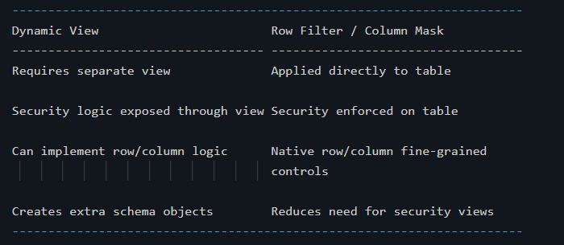
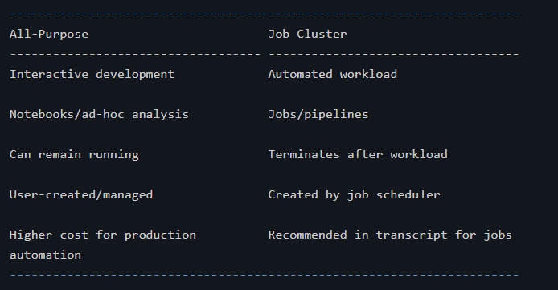

# Databricks Interview Notes --- DBSQL, Unity Catalog, Fine-Grained Governance & Compute

> **Level:** Beginner → Interview Ready\
> **Source:** Supplied course transcript\
> **Coverage:** Databricks SQL, SQL Warehouses, dashboards/alerts,
> legacy object privileges, Unity Catalog, managed-table conversion,
> predictive optimization, row filters, column masks, ABAC,
> classic/serverless compute, instance pools, spot instances, SQL
> Warehouses.

------------------------------------------------------------------------

# 1. Databricks SQL (DBSQL)

Databricks SQL, also called **DBSQL**, is presented in the transcript as
the SQL/data-warehouse experience for running SQL and BI workloads at
scale with unified governance.

Important workspace features mentioned:

-   SQL Editor
-   Queries
-   Dashboards
-   Alerts
-   Data Explorer / Catalog Explorer
-   SQL Warehouses

## SQL Warehouse

A **SQL Warehouse** provides the compute used by Databricks SQL.

Simple mental model:

``` text
SQL query / dashboard
        ↓
SQL Warehouse
        ↓
Data
```

The transcript describes it as a SQL engine/endpoint and later explains
that SQL Warehouses are highly optimized for SQL workloads and
concurrency.

### Interview answer

**Q: What is a SQL Warehouse?**

**Answer:** A SQL Warehouse is Databricks compute optimized for SQL
workloads such as SQL queries, BI dashboards, ETL, and data exploration.

------------------------------------------------------------------------

# 2. Databricks SQL Dashboards

The transcript demonstrates importing a sample dashboard and then
modifying it.

A dashboard can contain multiple visualizations backed by SQL queries.

Typical flow:

``` text
SQL Query
   ↓
Result
   ↓
Visualization
   ↓
Dashboard
```

Dashboard actions shown include:

-   refresh underlying queries,
-   inspect the query behind a visualization,
-   edit visualization settings,
-   add new charts,
-   resize/rearrange charts,
-   share dashboards.

## Dashboard credentials

The transcript describes two execution choices:

``` text
Viewer credentials
→ use the viewer's access to underlying data

Run As Owner
→ execute using the owner's credentials
```

This matters when deciding how shared dashboards access governed data.

------------------------------------------------------------------------

# 3. SQL Editor

The SQL Editor is used to write and run custom SQL.

The transcript demonstrates:

``` sql
SELECT ...
FROM ...
GROUP BY ...
```

with an aggregation such as:

``` sql
SUM(fare_amount)
```

Queries can be:

-   executed,
-   saved,
-   added to dashboards,
-   scheduled for refresh.

The editor uses a SQL Warehouse for compute.

------------------------------------------------------------------------

# 4. Three-Level Namespace

The transcript introduces the Unity Catalog three-level namespace:

``` text
catalog.schema.table
```

The transcript sometimes calls schema a database.

Example concept:

``` text
main.hr_db.employees
```

Where:

``` text
main       → catalog
hr_db      → schema/database
employees  → table
```

This namespace is a fundamental Unity Catalog interview topic.

------------------------------------------------------------------------

# 5. Databricks SQL Alerts

Alerts monitor a saved query result.

The transcript defines an alert as a notification mechanism triggered
when a query field meets a threshold.

Example:

``` text
Saved query
   ↓
total_fare > 10,000 ?
   ↓
YES → Alert triggered
```

Notification destinations mentioned include:

-   email,
-   Slack,
-   Microsoft Teams.

### Interview answer

**Q: What is a Databricks SQL alert?**

**Answer:** An alert evaluates a saved SQL query result and sends a
notification when a configured field satisfies a threshold condition.

------------------------------------------------------------------------

# 6. Data Object Privileges --- Legacy/Hive Metastore Model in the Transcript

The transcript first discusses the older governance model before
introducing Unity Catalog.

Permissions can be granted on objects such as:

-   catalog,
-   schema/database,
-   table,
-   view,
-   named function,
-   underlying files using `ANY FILE`.

The general idea is:

``` sql
GRANT <privilege>
ON <object>
TO <user_or_group>;
```

------------------------------------------------------------------------

# 7. Important Privileges in the Legacy Model

The transcript lists:

## SELECT

Read/query an object.

## MODIFY

Add, delete, or modify data.

## CREATE

Create an object, such as a table inside a database.

## READ_METADATA

View an object and its metadata.

## USAGE

An additional prerequisite for operating on database objects in the
legacy model described.

## ALL PRIVILEGES

Provides all applicable privileges described above.

------------------------------------------------------------------------

# 8. Who Can Grant Privileges?

The transcript describes permission authority based on ownership/admin
rights.

Conceptually:

``` text
Databricks admin
→ broad authority

Catalog owner
→ objects in catalog

Database/schema owner
→ objects in that database/schema

Table owner
→ that table
```

Similar ownership rules apply to views and functions.

------------------------------------------------------------------------

# 9. GRANT, DENY, REVOKE and SHOW GRANTS

Operations discussed:

``` text
GRANT
→ give privilege

DENY
→ explicitly deny privilege

REVOKE
→ remove privilege

SHOW GRANTS
→ inspect assigned privileges
```

The transcript demonstrates managing permissions through both SQL and
the data-explorer interface.

------------------------------------------------------------------------

# 10. Data Explorer

The transcript presents Data Explorer as a UI for navigating objects
such as:

-   databases/schemas,
-   tables,
-   views.

It can show:

-   schema,
-   metadata,
-   history,
-   owner,
-   permissions.

Permissions can also be granted/revoked through the UI.

The transcript notes that the legacy `ANY FILE` object requires SQL
rather than being configured through Data Explorer in the demonstrated
setup.

------------------------------------------------------------------------

# 11. Unity Catalog --- Basic Idea

Unity Catalog is presented as Databricks' centralized governance
solution across workspaces.

It governs data and AI assets such as:

-   files,
-   tables,
-   machine-learning models,
-   dashboards.

The key idea:

``` text
Without centralized governance
Workspace A → separate identities/access
Workspace B → separate identities/access

With Unity Catalog
           Account / Unity Catalog
              ↙          ↘
       Workspace A    Workspace B
```

Access rules and identities can therefore be centrally managed.

### Interview answer

**Q: What is Unity Catalog?**

**Answer:** Unity Catalog is Databricks' centralized governance layer
for managing data and AI assets, identities, permissions, discovery, and
lineage across workspaces.

------------------------------------------------------------------------

# 12. Unity Catalog Metastore

The transcript describes the **metastore** as the top-level logical
container in Unity Catalog.

It contains metadata and access-control information for governed
objects.

Conceptually:

``` text
Unity Catalog Metastore
        ↓
Catalog
        ↓
Schema
        ↓
Tables / Views / Functions
```

Do not confuse:

``` text
Unity Catalog Metastore
vs
Legacy Hive Metastore
```

The transcript says the legacy Hive Metastore remains accessible
through:

``` text
hive_metastore
```

after Unity Catalog is enabled.

------------------------------------------------------------------------

# 13. Unity Catalog Hierarchy

Memorize:

``` text
Metastore
   ↓
Catalog
   ↓
Schema
   ↓
Table / View / Function
```

For table addressing:

``` text
catalog.schema.table
```

Catalog is the first namespace level.

Schema/database is the second.

The data object is the third.

------------------------------------------------------------------------

# 14. Storage Credentials and External Locations

The transcript introduces:

## Storage Credential

Authentication mechanism for underlying cloud storage.

## External Location

Represents a storage directory/path within cloud storage and uses
governed storage credentials.

Simple model:

``` text
Storage Credential
→ how Databricks authenticates

External Location
→ which cloud-storage location is governed/referenced
```

------------------------------------------------------------------------

# 15. Unity Catalog Principals

Three principal/identity types are discussed:

1.  Users
2.  Service principals
3.  Groups

## User

Represents an individual person.

## Service principal

Identity intended for automated applications/tools.

This is especially important in CI/CD and automated workloads.

## Group

Collection of users and/or service principals.

Groups can also be nested according to the transcript.

------------------------------------------------------------------------

# 16. Identity Federation

The transcript describes **Identity Federation** as creating identities
centrally at the account level and assigning them to workspaces as
needed.

Conceptually:

``` text
Account-level identity
       ↓
   ┌───┴───┐
Workspace A Workspace B
```

Benefit:

> Avoid maintaining duplicate workspace-level copies of the same
> identities.

------------------------------------------------------------------------

# 17. Unity Catalog Privileges

Privileges mentioned include:

``` text
CREATE
SELECT
MODIFY
READ FILES
WRITE FILES
EXECUTE
USE SCHEMA
USE CATALOG
```

A major interview point is the parent-object access requirement.

To work with an object inside a schema, the transcript says the user
needs:

``` text
USE CATALOG
    +
USE SCHEMA
    +
required object privilege
```

Example for querying a table:

``` text
USE CATALOG on parent catalog
+
USE SCHEMA on parent schema
+
SELECT on table
```

------------------------------------------------------------------------

# 18. Unity Catalog Is Additive

The transcript says enabling Unity Catalog does not make the legacy Hive
Metastore disappear.

The catalog:

``` text
hive_metastore
```

continues to provide access to the workspace's legacy Hive Metastore.

This allows legacy and Unity Catalog objects to coexist.

------------------------------------------------------------------------

# 19. Data Discovery and Lineage

Unity Catalog provides data search/discovery and automated lineage.

Lineage helps answer:

``` text
Where did this data come from?
        ↓
What transformed it?
        ↓
Where is it used?
```

The transcript mentions downstream assets such as:

-   queries,
-   notebooks,
-   dashboards.

It also describes **column-level lineage**.

### Interview answer

**Q: Why is lineage useful?**

**Answer:** Lineage lets teams trace the origin, transformations, and
downstream usage of data, which helps with impact analysis,
troubleshooting, governance, and compliance.

------------------------------------------------------------------------

# 20. Unity Catalog Audit Information

The transcript explains that Unity Catalog records detailed data-access
and governance events in a system table.

This supports:

-   security monitoring,
-   compliance,
-   auditing.

------------------------------------------------------------------------

# 21. Converting an External Delta Table to Managed

The advanced section introduces:

``` sql
ALTER TABLE <table_name> SET MANAGED
```

The transcript says this converts an external Delta table into a Unity
Catalog managed table by copying data to the managed location.

The original location is retained for a 14-day rollback period according
to the supplied material.

Benefits listed over CTAS include:

-   retains table history,
-   retains configurations,
-   keeps table name,
-   keeps Unity Catalog permissions,
-   keeps tags/properties,
-   keeps associated views,
-   supports rollback,
-   minimizes downtime,
-   handles concurrent writes,
-   redirects path-based access.

Rollback command discussed:

``` text
UNSET MANAGED
```

within the stated rollback window.

------------------------------------------------------------------------

# 22. Streaming During Managed-Table Conversion

The transcript says active streams are intentionally interrupted during
conversion to prevent corruption or missed updates.

Error mentioned:

``` text
DELTA_STREAMING_INTERRUPTED_BY_MANAGED_TABLE_CONVERSION
```

The supplied material's recovery step is:

``` text
Restart the streaming job
```

With the same configuration, it can continue using Unity Catalog's
redirection behavior described in the transcript.

------------------------------------------------------------------------

# 23. Predictive Optimization

Predictive Optimization is described as an AI-driven maintenance feature
for Unity Catalog managed tables.

It automatically performs maintenance operations including:

``` text
OPTIMIZE
VACUUM
ANALYZE
```

## OPTIMIZE

Improves data layout/clustering.

The transcript notes that Predictive Optimization does **not** run
ZORDER as part of its OPTIMIZE operation.

## VACUUM

Removes data files that are no longer referenced, reducing storage
usage.

## ANALYZE

Updates table statistics used by the query optimizer.

### Interview phrase

> Predictive Optimization automates table-maintenance operations for
> Unity Catalog managed tables.

------------------------------------------------------------------------

# 24. Enabling Predictive Optimization

The transcript says it can be controlled at account level and also at
catalog/schema level.

Commands shown:

``` sql
ALTER CATALOG <catalog_name>
ENABLE PREDICTIVE OPTIMIZATION;
```

and:

``` sql
ALTER SCHEMA <schema_name>
ENABLE PREDICTIVE OPTIMIZATION;
```

The supplied material recommends enabling it for Unity Catalog managed
tables.

------------------------------------------------------------------------

# 25. Fine-Grained Access Control

The transcript moves from object-level permissions to finer control.

Object-level permission answers:

``` text
Can this user access this table?
```

Fine-grained access answers:

``` text
Which rows can the user see?
Which column values can the user see?
```

Three techniques discussed:

1.  Dynamic Views
2.  Table-level Row Filters and Column Masks
3.  ABAC Policies

------------------------------------------------------------------------

# 26. Dynamic Views

Dynamic views implement conditional security by creating a view over a
table.

The transcript uses:

``` text
is_account_group_member(...)
```

to check whether the current user belongs to an authorized group.

Example concept:

``` text
Admin user
→ email visible

Normal user
→ email redacted
```

For row filtering:

``` text
Admin
→ all countries

Normal user
→ France only
```

### Limitation

Dynamic views require additional view objects in the schema.

------------------------------------------------------------------------

# 27. Table-Level Column Masks

Unity Catalog can apply masking directly to table columns.

The transcript's pattern is:

``` text
1. Create masking UDF
2. Attach UDF as mask to column
3. Query table normally
4. Unity Catalog dynamically masks value
```

Command pattern:

``` sql
ALTER TABLE ...
ALTER COLUMN ...
SET MASK ...
```

Example:

``` text
Authorized user → swapnil@example.com
Unauthorized    → [REDACTED]
```

------------------------------------------------------------------------

# 28. Table-Level Row Filters

A row filter restricts which rows a user sees.

Pattern:

``` text
1. Create filtering UDF
2. Attach filter to table
3. Query table normally
4. Filter evaluates dynamically
```

Command pattern:

``` sql
ALTER TABLE ...
SET ROW FILTER ...
```

Example:

``` text
Admin
→ all rows

Non-admin
→ only France rows
```

------------------------------------------------------------------------

# 29. Dynamic Views vs Table-Level Security



------------------------------------------------------------------------

# 30. Why ABAC?

Table-level row filters and masks are useful, but the transcript points
out a scalability issue:

``` text
Rule defined separately
for Table A
for Table B
for Table C
...
```

ABAC addresses this by centrally applying policies based on
attributes/tags.

------------------------------------------------------------------------

# 31. ABAC

**ABAC = Attribute-Based Access Control**

The transcript describes ABAC policies as centrally defined row-filter
and column-mask policies driven by tags.

Conceptually:

``` text
Tag data
   ↓
Define central policy
   ↓
Policy matches tagged objects
   ↓
Mask/filter automatically enforced
```

------------------------------------------------------------------------

# 32. Tags

Tags are key/value metadata used to categorize Unity Catalog objects,
including columns.

Example:

``` text
PII = email_address
```

Another example:

``` text
geo_restricted
```

with no value.

The transcript explains that a no-value tag can behave like a Boolean
classification:

``` text
tag exists → object is geographically restricted
```

------------------------------------------------------------------------

# 33. Governed Tags

ABAC in the transcript uses **Governed Tags**.

These are account-level tags centrally managed for consistent
classification.

Example:

``` text
Tag key: PII

Allowed values:
email_address
phone_number
credit_card
SSN
```

Permissions can also control who can manage or assign governed tags.

------------------------------------------------------------------------

# 34. ABAC Column-Masking Example

The transcript's conceptual example:

``` text
Column tagged:
PII = email_address
       ↓
ABAC policy
       ↓
All users except admins_demo
       ↓
mask_email function
       ↓
Email automatically masked
```

This policy can apply across matching tables instead of configuring
every table individually.

------------------------------------------------------------------------

# 35. ABAC Row-Filtering Example

Conceptual example:

``` text
Table tagged:
geo_restricted

Country column tagged:
geo_restricted
       ↓
ABAC row-filter policy
       ↓
geo_filter function
       ↓
Unauthorized users see restricted rows
```

The transcript says policies can propagate across existing and future
tables where matching tags are present.

### Main benefit

``` text
Central policy
+
consistent tags
=
scalable governance
```

------------------------------------------------------------------------

# 36. Fine-Grained Security Comparison

  -----------------------------------------------------------------------
  Technique         Scope             Main Advantage    Main Limitation
  ----------------- ----------------- ----------------- -----------------
  Dynamic View      View              Flexible          Extra view
                                      conditional logic objects

  Column Mask       Table column      Native column     Configured per
                                      masking           table/column

  Row Filter        Table             Native row        Configured per
                                      restriction       table

  ABAC              Central/tag       Reusable across   Requires governed
                    driven            matching assets   tagging/policy
                                                        design
  -----------------------------------------------------------------------

------------------------------------------------------------------------

# 37. Databricks Compute Overview

The transcript divides compute into two broad categories:

``` text
Databricks Compute
      ↓
 ┌────┴────┐
Classic   Serverless
```

Classic provides more infrastructure control.

Serverless provides a more fully managed experience.

------------------------------------------------------------------------

# 38. Classic Compute

Classic compute resources are handled through the cloud-provider
infrastructure.

The transcript discusses:

-   all-purpose clusters,
-   job clusters,
-   instance pools,
-   SQL Warehouses.

Classic compute provides more flexibility and customization than
serverless.

------------------------------------------------------------------------

# 39. All-Purpose Cluster

Designed for:

-   interactive notebooks,
-   development,
-   ad-hoc analysis.

Conceptually:

``` text
Developer
   ↓
Notebook
   ↓
All-purpose cluster
```

The cluster can remain active until manually terminated or until
auto-termination occurs.

------------------------------------------------------------------------

# 40. Job Cluster

Designed for automated:

-   jobs,
-   pipelines.

The transcript associates it with Lakeflow Jobs and Declarative ETL
Pipelines.

Conceptually:

``` text
Job starts
   ↓
Job cluster created
   ↓
Tasks execute
   ↓
Job completes
   ↓
Cluster terminates
```

The transcript recommends job clusters for jobs/pipelines because they
are more cost-effective than keeping all-purpose compute running.

------------------------------------------------------------------------

# 41. All-Purpose vs Job Cluster


------------------------------------------------------------------------

# 42. Choosing Instance Families

The transcript describes several VM families.

## Memory Optimized

Good for:

-   heavy shuffling/spilling,
-   Spark memory caching,
-   memory-intensive ML.

## Compute Optimized

Good for:

-   CPU-intensive work,
-   Structured Streaming,
-   full scans without reuse,
-   performance-intensive operations such as OPTIMIZE/Z-order in the
    transcript.

## Storage Optimized

Good for:

-   large-scale disk caching,
-   rapid data access,
-   Delta caching,
-   interactive/ad-hoc workloads benefiting from disk cache.

## GPU Optimized

Good for:

-   advanced ML,
-   deep learning,
-   workloads requiring GPU/extreme compute-memory capability.

## General Purpose

Good when no special optimization is required.

The transcript also associates it with maintenance operations such as
VACUUM.

------------------------------------------------------------------------

# 43. Spot Instances

Spot instances use unused cloud capacity at lower price.

Benefit:

``` text
Lower infrastructure cost
```

Risk:

``` text
Cloud provider can reclaim instance
→ workload can be interrupted
```

The transcript suggests them for interruption-tolerant workloads such
as:

-   temporary/batch ETL,
-   ML training.

------------------------------------------------------------------------

# 44. Instance Pools

An instance pool contains idle, ready-to-use VMs.

Purpose:

``` text
Ready instances
     ↓
Faster cluster creation
     ↓
Faster autoscaling
```

Good when jobs need fast startup.

Important cost point from the transcript:

> Databricks may not charge for idle pool instances, but the cloud
> provider still charges because the VMs are running.

------------------------------------------------------------------------

# 45. Serverless Compute

Serverless compute is presented as on-demand compute managed
automatically by Databricks.

Databricks handles:

-   infrastructure allocation,
-   scaling,
-   runtime upgrades,
-   instance-type selection,
-   performance optimizations.

Benefits mentioned:

-   rapid startup,
-   fast scaling,
-   less operational overhead,
-   reduced idle time.

The transcript describes it as versionless because Databricks manages
runtime upgrades.

------------------------------------------------------------------------

# 46. Serverless vs Classic

  -----------------------------------------------------------------------
  Serverless                          Classic
  ----------------------------------- -----------------------------------
  Fully managed                       More user-managed

  Minimal configuration               Greater customization

  Automatic scaling/tuning            Manual configuration available

  Fast startup                        Typically more setup/startup
                                      overhead

  Runtime automatically upgraded      Runtime/configuration controlled
                                      manually

  Transcript says Python + SQL        Supports Databricks language
  support                             options

  Higher DBU rate but VM cost         DBU + underlying cloud VM cost
  included                            
  -----------------------------------------------------------------------

The transcript emphasizes evaluating **total cost**, not DBU price
alone.

------------------------------------------------------------------------

# 47. Specialized Serverless Compute

The transcript mentions serverless compute optimized for:

-   notebooks,
-   jobs,
-   pipelines.

It also explains that SQL Warehouses can be serverless.

------------------------------------------------------------------------

# 48. SQL Warehouse Types

The transcript identifies two main types:

``` text
Serverless SQL Warehouse
Pro SQL Warehouse
```

## Serverless SQL Warehouse

Recommended in the transcript for:

-   ETL,
-   business intelligence,
-   data exploration.

## Pro SQL Warehouse

Use when:

-   serverless is unavailable in a region, or
-   custom networking is required.

Examples include connecting to:

-   databases in a cloud network,
-   on-premises services,
-   hybrid architectures.

------------------------------------------------------------------------

# 49. SQL Warehouse vs General Compute

SQL Warehouses are specifically optimized for:

``` text
SQL queries
BI
Dashboards
Concurrency
SQL-based exploration
```

All-purpose/job/serverless compute serves broader notebook, job,
pipeline, or engineering workloads.

------------------------------------------------------------------------

# 50. End-to-End Governance Mental Model

``` text
Account
  ↓
Unity Catalog Metastore
  ↓
Catalog
  ↓
Schema
  ↓
Table / View
  ↓
Object Privileges
  ↓
Fine-Grained Controls
  ├── Dynamic Views
  ├── Row Filters
  ├── Column Masks
  └── ABAC Policies
  ↓
Governed Data Consumption
  ├── SQL Queries
  ├── Dashboards
  └── BI
```

------------------------------------------------------------------------

# 51. End-to-End Compute Mental Model

``` text
Interactive development?
→ All-purpose cluster

Automated classic job/pipeline?
→ Job cluster

Want minimal infrastructure management?
→ Serverless compute

SQL / BI / dashboards?
→ SQL Warehouse

Need faster classic cluster startup?
→ Instance Pool

Can tolerate interruption and want lower VM cost?
→ Spot instances
```

------------------------------------------------------------------------

# 52. Important Interview Questions

## Q1. What is Databricks SQL?

A SQL/data-warehouse experience for executing SQL and BI workloads at
scale with governed data access.

## Q2. What provides compute for DBSQL?

A SQL Warehouse.

## Q3. What is the Unity Catalog namespace?

`catalog.schema.table`.

## Q4. What is Unity Catalog?

A centralized governance solution for data and AI assets across
Databricks workspaces.

## Q5. What is a Unity Catalog metastore?

The top-level logical governance container holding metadata and
access-control information.

## Q6. What are the three principal types discussed?

Users, service principals, and groups.

## Q7. What is Identity Federation?

Central account-level identity management with identities assigned to
one or more workspaces.

## Q8. What privileges are needed to query a Unity Catalog table?

The transcript's model requires `USE CATALOG` on the parent catalog,
`USE SCHEMA` on the parent schema, and `SELECT` on the table.

## Q9. What is lineage?

Tracking where data originates and where it is used downstream.

## Q10. What is Predictive Optimization?

Automated maintenance for Unity Catalog managed tables using operations
such as OPTIMIZE, VACUUM, and ANALYZE.

## Q11. What is a column mask?

A rule that dynamically hides/transforms a column value for unauthorized
users.

## Q12. What is a row filter?

A rule that dynamically limits which rows a user can see.

## Q13. What is ABAC?

Attribute-Based Access Control: centralized security policies applied
according to attributes/tags.

## Q14. Why is ABAC more scalable than per-table masks?

Because one centrally defined tag-based policy can apply consistently to
multiple matching tables/columns.

## Q15. All-purpose cluster vs job cluster?

All-purpose is mainly for interactive development; job clusters are for
automated jobs/pipelines and terminate after completion.

## Q16. What is an instance pool?

A pool of ready-to-use idle VMs that reduces classic cluster
startup/autoscaling time.

## Q17. What are spot instances?

Discounted unused cloud capacity that may be reclaimed by the cloud
provider.

## Q18. What is serverless compute?

Databricks-managed compute where infrastructure allocation, scaling, and
much tuning are automated.

## Q19. Classic vs serverless?

Classic gives greater control/customization; serverless minimizes
infrastructure management and automates scaling/tuning.

## Q20. Serverless SQL Warehouse vs Pro?

Use serverless for typical ETL/BI/exploration; use Pro when serverless
is unavailable or custom networking is needed, according to the
transcript.

------------------------------------------------------------------------

# 53. Scenario Question --- Secure Customer Data

**Q: A customer table contains email addresses and users should see
different rows based on geography. How could you secure it?**

**Answer:**

> At the object level, I would first use Unity Catalog privileges to
> control who can access the catalog, schema, and table. For
> fine-grained security, I could use a column mask for the email field
> and a row filter for geographic restrictions. If the same rules need
> to apply across many tables, I would prefer an ABAC design: classify
> sensitive columns using governed tags such as `PII=email_address`,
> classify geographically restricted assets with another governed tag,
> and create centralized ABAC policies that apply the masking and
> filtering functions to matching tagged assets.

------------------------------------------------------------------------

# 54. Scenario Question --- Choosing Compute

**Q: Which Databricks compute would you choose for development,
scheduled ETL, and BI?**

**Answer:**

> For interactive notebook development, I would use an all-purpose
> cluster or the appropriate serverless notebook compute. For automated
> jobs and pipelines under the classic model, I would use job clusters
> because they are lifecycle-managed around the workload. If I want
> Databricks to manage most infrastructure details, I would consider
> serverless compute. For SQL queries, BI dashboards, and SQL-oriented
> analytics, I would use a SQL Warehouse, preferably serverless when it
> fits the networking and regional requirements described in the
> transcript.

------------------------------------------------------------------------

# 55. Fast Revision Sheet

``` text
DBSQL
Databricks SQL/data warehouse experience.

SQL WAREHOUSE
Compute optimized for SQL workloads.

ALERT
Notify when query result meets threshold.

UNITY CATALOG
Centralized governance for data/AI assets.

3-LEVEL NAMESPACE
catalog.schema.table

METASTORE
Top-level Unity Catalog governance container.

PRINCIPALS
Users, service principals, groups.

IDENTITY FEDERATION
Create identities centrally and assign them to workspaces.

USE CATALOG
Required parent-catalog access.

USE SCHEMA
Required parent-schema access.

SELECT
Read table/view data.

LINEAGE
Track upstream origin and downstream usage.

SET MANAGED
Convert external Delta table to managed table.

PREDICTIVE OPTIMIZATION
Automatic OPTIMIZE + VACUUM + ANALYZE.

DYNAMIC VIEW
Fine-grained security using a view.

COLUMN MASK
Dynamically hide/transform column values.

ROW FILTER
Dynamically restrict rows.

ABAC
Central tag-based access-control policies.

GOVERNED TAG
Centrally managed classification attribute.

ALL-PURPOSE CLUSTER
Interactive development/ad-hoc analysis.

JOB CLUSTER
Automated jobs/pipelines.

SPOT INSTANCE
Cheaper but interruptible cloud VM.

INSTANCE POOL
Ready-to-use VMs for faster cluster startup.

SERVERLESS
Databricks-managed compute.

SERVERLESS SQL WAREHOUSE
Preferred transcript option for normal SQL/BI/ETL.

PRO SQL WAREHOUSE
Useful for custom networking or where serverless is unavailable.
```

------------------------------------------------------------------------

# 56. 90-Second Interview Explanation

If asked **"Explain Databricks governance and compute choices"**, you
can answer:

> Databricks uses Unity Catalog as a centralized governance layer. Its
> main hierarchy is metastore, catalog, schema, and then objects such as
> tables and views, with tables addressed using the three-level
> namespace `catalog.schema.table`. Access is granted to principals such
> as users, groups, and service principals. To query a table, the
> transcript's model requires access to the parent catalog and schema
> plus the relevant table privilege. For more granular security, Unity
> Catalog supports dynamic views, table-level row filters, column masks,
> and ABAC policies. ABAC is especially scalable because governed tags
> can classify assets such as PII columns and centralized policies can
> apply masking or filtering across matching tables. Unity Catalog also
> provides discovery, audit information, and lineage. On the compute
> side, I would use all-purpose compute for interactive development, job
> clusters for automated classic jobs and pipelines, serverless when I
> want Databricks to manage infrastructure and scaling, and SQL
> Warehouses for SQL, BI, and dashboard workloads.

------------------------------------------------------------------------

# 57. Highest-Priority Topics to Revise

1.  Databricks SQL and SQL Warehouses
2.  SQL dashboards, query scheduling, and alerts
3.  `catalog.schema.table`
4.  Unity Catalog purpose and hierarchy
5.  Unity Catalog vs legacy Hive Metastore
6.  Users, groups, and service principals
7.  Identity Federation
8.  `USE CATALOG` + `USE SCHEMA` + object privilege
9.  Data discovery and lineage
10. External → managed table conversion
11. Predictive Optimization
12. Dynamic views
13. Column masks
14. Row filters
15. ABAC
16. Governed Tags
17. All-purpose vs job clusters
18. Instance families
19. Spot instances
20. Instance pools
21. Classic vs serverless compute
22. Serverless vs Pro SQL Warehouses

The strongest interview preparation is to be able to explain the full
chain:

``` text
Governed data
→ Unity Catalog hierarchy
→ privileges
→ fine-grained ABAC/masks/filters
→ SQL Warehouse / compute choice
→ SQL query
→ dashboard / BI consumption
```
